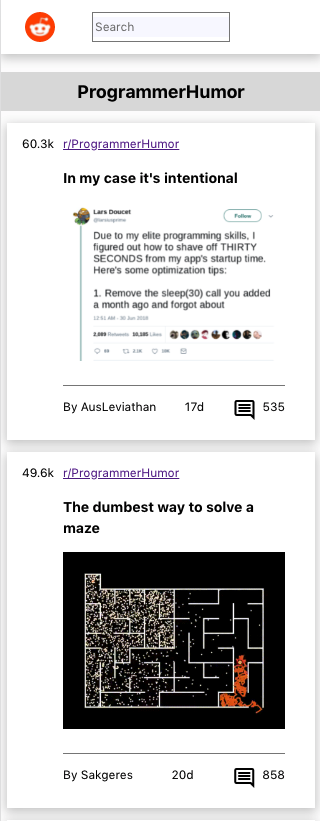
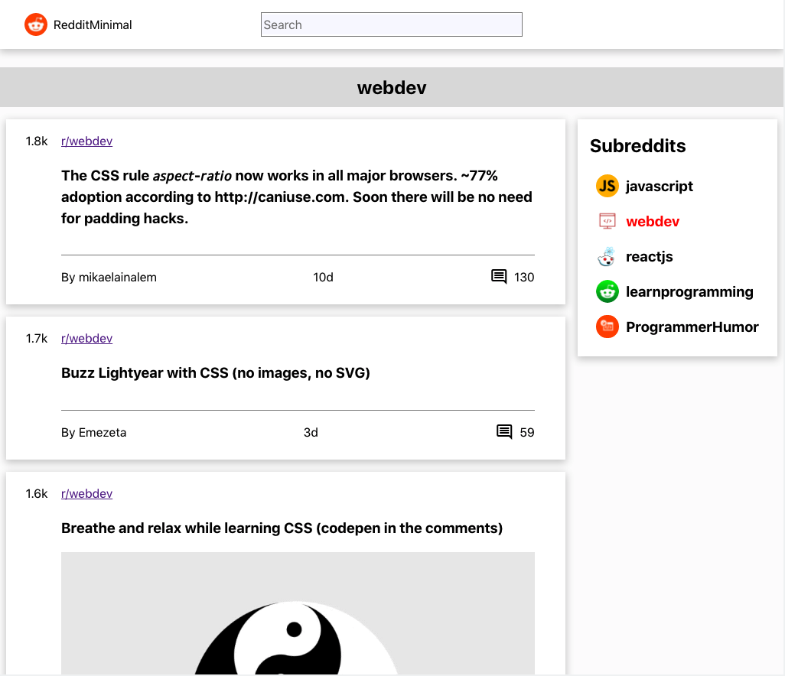

# Minimal Reddit
> This is a Reddit reader app which allows the user to browse top posts this month, from a select number of subreddits. The data for the app comes from the reddit.json API. The pared back design aims to create a minimalist user experience free from distrations.
> Live demo [_here_](https://minimal-reddit.netlify.app/). <!-- If you have the project hosted somewhere, include the link here. -->

## Table of Contents
* [General Info](#general-information)
* [Technologies Used](#technologies-used)
* [Features](#features)
* [Usage](#usage)
* [Screenshots](#screenshots)
* [Setup](#setup)
* [Project Status](#project-status)
* [Room for Improvement](#room-for-improvement)
* [Acknowledgements](#acknowledgements)
* [Contact](#contact)
<!-- * [License](#license) -->

## General Information
The Minimal Reddit app aims to give the user an essentialist, yet attractive interface for browsing the subreddits they care about.

The app serves up a Homepage of posts from a select number of subreddits and users can choose to click into the subreddit page to focus on posts within. The user can navigate into a detail view of each posts at any stage, where the associated comments are loaded and displayed. Each page in the app has an URL, and the app can be loaded from any page's URL.

The app was built to explore the development process for a responsive, API connected, multi-page React app, which is paired with Redux for state management. 

In particular, I wanted to explore how to give the user an app like experience rather than refreshing with each new URL. To achieve this, the app uses state in its Redux store, to decide whether to make a new API call when the user navigates to a new page. 

The logic could've been split between redux reducers and action creators. I opted to put them in the thunk action creators in the middleware.

The project  React/Redux development process:

- Project planning and setting timelines.
- Designing and wireframing the app.
- Breaking down the app into React components
- Building static React components
- Connecting React components to Redux
- Connecting to API
- Publishing to the web
## Technologies Used
- React
- Redux
- Redux Toolkit
- React Router
- Jest
- React Testing Library
- Figma
- HTML
- CSS
- Netlify
## Features
- Users can use the application on any device (desktop to mobile)
- Users can use the application on any modern browser
- Users can access your application at a URL
- Users see an initial view of the data when first visiting the app
- Users can search the data using terms
- Users can filter the data based on categories that are predefined
- Users are shown a detail view (modal or new page/route) when they select an item
- Users are delighted with a cohesive design system
- Users are delighted with animations and transitions
- Users are able to leave an error state

## Usage

<!-- If you have screenshots you'd like to share, include them here. -->
## Screenshots
From initial wireframe to finalized app.

 
## Setup
Clone this repo and run npm install to install dependencies. 

## Project Status
Actively working on writing Unit, Integration and End-To-End tests for the app.
## Room for Improvement
- Allow user to specify sort order for fetched posts.
- Allow user to search for, add and delete subreddits.
- Create a dedicated search page to allow user to search for posts.
- Fetch and display more than the top layer of comments per post.
- Implement user authentication.
- Allow user to upvote or downvote posts and comments.
- Navigation buttons like 'scroll back to top' and 'go to homepage'
- Implement Dark Mode.
## Acknowledgements
- Many thanks to Laith Harb for his series on React Testing Library for introducing me to testing react components. 
https://www.youtube.com/channel/UCyLNhHSiEVkVwPSFKxJAfSA
## Contact
Created by Mike Guo - feel free to contact me at mikejguo290@hotmail.com or on GitHub!